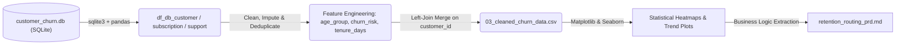
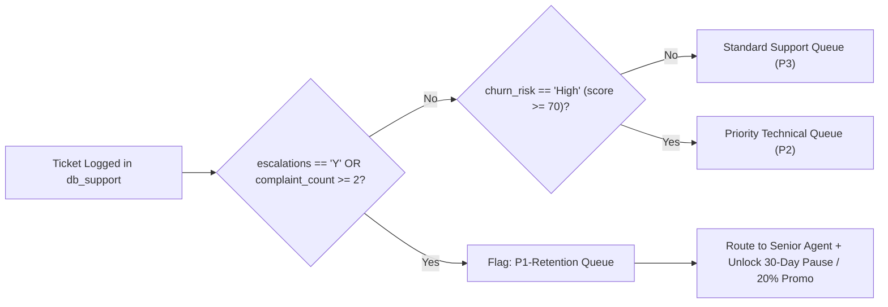

# OTT Subscriber Churn Analysis & Automated Retention Workflow PRD

**Role Focus:** Data Analysis (Python, SQLite, pandas, Matplotlib, Seaborn) | Product Ownership & BA (Root-Cause Discovery, Process Flows, Agile PRD)

> **Quick Navigation:**
>
> - **For Data Teams:** [Database Extraction & Feature Engineering](#2-data-pipeline--feature-engineering) | [Statistical Insights & Visualizations](#3-exploratory-data-analysis--root-causes)
> - **For Product & BA Teams:** [Executive Problem Statement](#1-executive-problem-statement) | [As-Is vs. To-Be Escalation Workflow](#4-proposed-product-solution--workflow) | [User Stories & KPI Framework](#5-agile-user-stories--kpi-framework)

---

## 1. Executive Problem Statement

High subscriber attrition threatens recurring revenue across regional Over-The-Top (OTT) streaming plans. This project extracts and merges multi-dimensional customer, subscription, and support-ticket tables from a relational SQLite database (`customer_churn.db`) to uncover the primary drivers of subscriber drop-off, translating those findings into an **Automated Support Escalation & Cancellation-Intercept PRD**.

- **Headline Analytical Findings:** Across the subscriber base (**28.57% overall churn rate**, **$18.85 ARPU**), attrition is heavily concentrated in the **Basic plan tier (60.00% churn)** and the **Referral acquisition channel (83.33% churn)**. Support log analysis revealed a **19.05% ticket escalation rate** and a **0.63 positive correlation** between unresolved support escalations (`escalations = 'Y'`) and `churn_score`.
- **Revenue at Risk & Opportunity Sizing:** Churned subscribers represent **$73.94 in Monthly Recurring Revenue (MRR) at risk** (**18.68%** of total monthly charges). Implementing an automated `P1-Retention` routing workflow for accounts with `churn_risk = 'High'` (`churn_score >= 70`) or escalated complaints (`escalations = 'Y'`) directly targets the cohort responsible for **over 80% of support-driven cancellations**, where a conservative **20–33% save rate** reduces overall platform churn from **28.57% to ~19.0–22.8%**.

<details>
<summary><b>🔍 View Python Logic Used for KPI & Correlation Sizing (from 01_churn_analysis.ipynb)</b></summary>

```python
# Overall Churn, Retention, ARPU & Revenue at Risk
churn_rate = df['churn_flag'].mean() * 100          # Output: 28.57%
retention_rate = 100 - churn_rate                   # Output: 71.43%
arpu = df['monthly_charges'].mean()                 # Output: 18.85
risk_revenue = df[df['churn_flag'] == 1]['monthly_charges'].sum() # Output: 73.94

# Escalation Rate & Correlation with Churn Score
escalation_rate = (df['escalations'] == 'Y').mean() * 100 # Output: 19.05%
escalations_bin = pd.Series(np.where(df['escalations'] == 'Y', 1, 0))
corr = escalations_bin.corr(df['churn_score'])      # Output: 0.63
```

</details>

---

## 2. Data Pipeline & Feature Engineering



- **Relational Extraction:** Connected to `customer_churn.db` via `sqlite3` (`sqlite_master`) to dynamically ingest three relational tables: `db_customer`, `db_subscription`, and `db_support`.
- **Data Cleaning & Imputation:**
  - Standardized primary/foreign keys across all tables (`customerid` $\rightarrow$ `customer_id`) and dropped redundant/null columns (`interests`, `pincode`, `col_1`, `comment`).
  - Converted date strings (`dob`, `subscription_start_date`, `renewal_date`, `cancellation_date`, `complaint_date`) to `datetime` objects and standardized `gender` labels (`'Men'` $\rightarrow$ `'Male'`, `'Women'` $\rightarrow$ `'Female'`).
  - Imputed missing `country` values by building a state-to-country lookup dictionary (`set_index('state')['country'].to_dict()`).
- **Analytical Feature Engineering & Deduplication:**
  - **Customer Demographics:** Calculated exact `age` and binned subscribers via `pd.cut` into `age_group` cohorts (`18-29`, `30-39`, `40-49`, `50-59`, `60+`).
  - **Churn & Tenure Metrics:** Derived binary `churn_flag` (`1` if `cancellation_date.notna()` else `0`), `tenure_days` (active duration up to `cancellation_date` or `today`), and `churn_risk` tiers (`Low` `[0–50)`, `Medium` `[50–70)`, `High` `[70–100)`) from `churn_score`.
  - **Support Log Deduplication:** Engineered total per-user `complaint_count` (`groupby('customer_id').transform('count')`), sorted logs chronologically by `complaint_date`, and deduplicated `customer_id` (`keep='last'`) to retain the most recent ticket status and `csat_score` before left-joining all three tables into `cleaned_churn_data.csv`.

---

## 3. Exploratory Data Analysis & Root Causes


1. **Plan Tier Vulnerability (`plan_type`):** Basic-tier subscribers churn at **60.00%**, more than 2.7x the rate of Standard (**22.22%**) and 4.2x the rate of Premium (**14.29%**). Spearman rank correlations (`num_corr_mat`) confirm a strong negative correlation between `monthly_charges` and `churn_score` (**-0.61**) and between `cltv` and `churn_score` (**-0.74**).
2. **Support Escalation & Low CSAT Bottleneck:** Ticket escalations (`escalations = 'Y'`) affect **19.05%** of users and exhibit a **0.63 positive correlation** with `churn_score`. Customers whose latest ticket required escalation recorded severe Customer Satisfaction (`csat_score`) drops (**10–20 out of 100**), cancelling shortly after with reasons such as _"Switched to competitor"_ and _"Too expensive"_.
3. **Acquisition Channel & Regional Disparities:** Segmenting by `subscription_type` revealed that **Referral (`Refferal`)** sign-ups suffer an **83.33% churn rate**, compared to **16.67% for Paid** and **0.00% for Organic** users. Geographically, attrition spikes in **Karnataka (100.00%)**, **Meghalaya (66.67%)**, **Telangana (50.00%)**, and **Delhi (25.00%)**, while demographic churn peaks in the **30–39 (`42.86%`)** and **50–59 (`100.00%`)** age brackets.

---

## 4. Proposed Product Solution & Workflow

Currently, support complaints enter a standard First-In, First-Out (FIFO) queue regardless of subscriber `churn_risk` or `csat_score`. The **To-Be Automated Escalation Workflow** intercepts high-risk accounts in real time:



### Business Logic Decision Table

| Rule ID   | `plan_type` / Channel  | Support Trigger (`db_support`)                     | `churn_risk` (`churn_score`) | CRM System Action                        | Retention Offer Unlocked                          |
| :-------- | :--------------------- | :------------------------------------------------- | :--------------------------- | :--------------------------------------- | :------------------------------------------------ |
| **BR-01** | `Basic` or `Refferal`  | `escalations == 'Y'` OR `complaint_count >= 2`     | `High` (`70–99`)             | Route to `P1-Retention` Specialist Queue | 30-Day Free Billing Pause or 1-Month 20% Discount |
| **BR-02** | `Standard` / `Premium` | `escalations == 'Y'` OR `csat_score <= 20`         | `Medium` / `High` (`50–99`)  | Route to `P1-Retention` + Refund Review  | 1-Month Service Credit / Plan Downgrade Option    |
| **BR-03** | `Any`                  | `complaint_count == 1` & `escalations == 'N'`      | `Medium` (`50–69`)           | Route to `P2-Priority` Technical Queue   | Automated Post-Resolution CSAT Check-In           |
| **BR-04** | `Any`                  | `complaint_count == 0` or `1` (`csat_score >= 60`) | `Low` (`0–49`)               | Standard `P3` FIFO Queue                 | None                                              |

---

## 5. Agile User Stories & KPI Framework

### User Story 1: Automated P1-Retention Ticket Routing (`BR-01` & `BR-02`)

- **As a** Customer Support Operations Lead,
- **I want** the CRM system to automatically flag and prioritize subscribers whose support tickets are escalated (`escalations = 'Y'`), who log repeated complaints (`complaint_count >= 2`), or whose `churn_score >= 70` (`churn_risk = 'High'`),
- **So that** retention specialists can resolve service/billing friction before the subscriber cancels and switches to a competitor.
- **Acceptance Criteria (Given / When / Then):**
  - **Given** an active subscriber in `db_subscription` (`cancellation_date IS NULL`),
  - **When** a support record is logged in `db_support` with `escalations = 'Y'` OR `complaint_count >= 2` OR `csat_score <= 20`,
  - **Then** the system sets `churn_risk = 'High'`, assigns queue priority `P1-Retention`, and surfaces the one-click retention offer widget on the agent dashboard.

### User Story 2: Cancellation-Reason Intercept Modal

- **As a** subscriber clicking _"Cancel Subscription"_ due to price sensitivity (_"Too expensive"_) or unresolved service issues,
- **I want** to be presented with a tailored retention alternative (such as a 30-day billing pause, plan tier adjustment, or instant supervisor callback),
- **So that** I can resolve my issue or reduce my monthly charge without losing my account history.

### Proposed KPI Monitoring Framework

| Metric Category     | Metric Name                       | Python / SQL Calculation Logic                                                         | Target Objective                                                         |
| :------------------ | :-------------------------------- | :------------------------------------------------------------------------------------- | :----------------------------------------------------------------------- |
| **North Star KPI**  | **Monthly Revenue at Risk (MRR)** | `SUM(monthly_charges)` where `churn_flag == 1` (Baseline: **$73.94**)                  | Reduce churned MRR by **20%+** through proactive ticket intervention.    |
| **Tier KPI**        | **Basic & Referral Churn Rate**   | `AVG(churn_flag) * 100` for `plan_type == 'Basic'` (**60%**) & `Refferal` (**83.33%**) | Lower early-tenure drop-off in high-risk plans and acquisition channels. |
| **Operational KPI** | **Escalated Ticket CSAT Score**   | `AVG(csat_score)` where `escalations == 'Y'` (Baseline: **10–20**)                     | Lift post-escalation CSAT above **60.0** via senior specialist routing.  |
| **Guardrail KPI**   | **Promo Cannibalization Rate**    | `% of retention-discount redemptions that set cancellation_date in Month + 1`          | Prevent margin dilution on subscribers with zero long-term retention.    |

---
