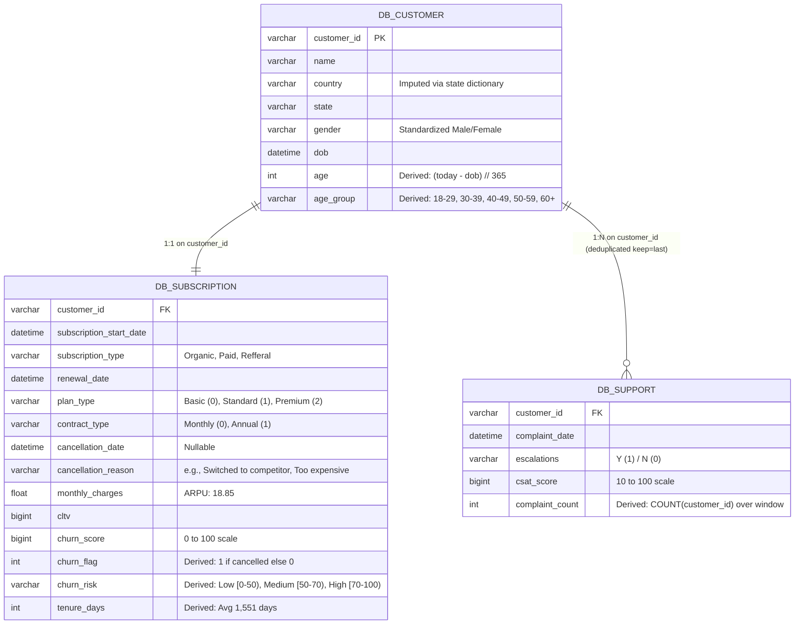
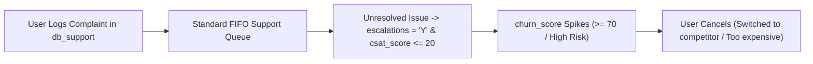
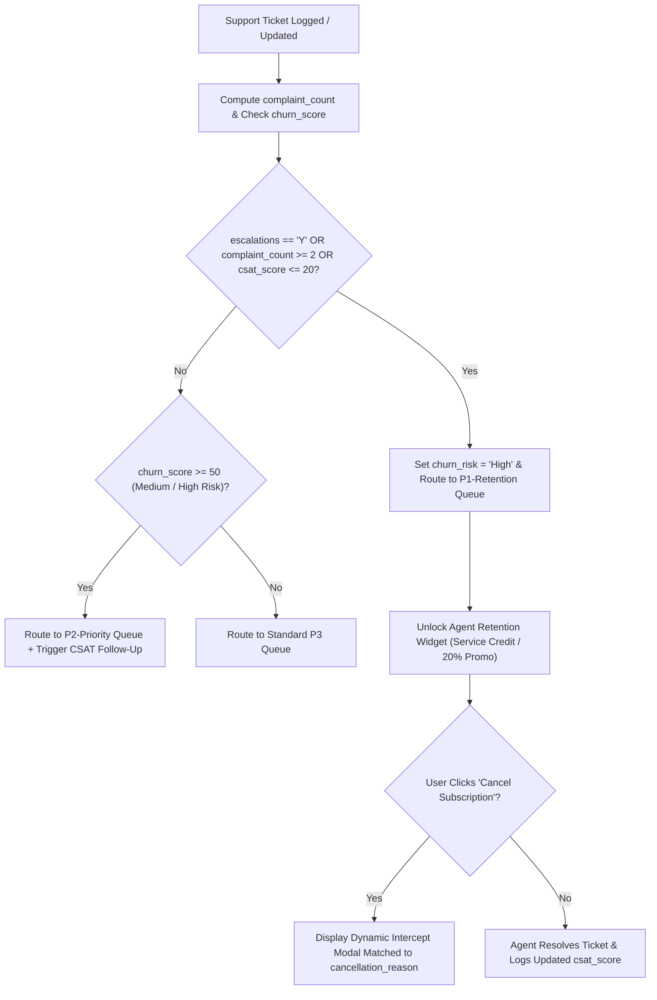

# Product Requirements Document (PRD): Automated Support Escalation & Retention Intercept

<!-- **Document ID:** PRD-OTT-2026-10   -->
<!-- **Author:** Nguyen Thu Thao   -->

**Role:** Associate Product Owner / Technical Business Analyst  
**Source Database:** SQLite (`customer_churn.db` $\rightarrow$ `cleaned_churn_data.csv`)  
**Status:** Case Study PRD (Backed by Historical Dataset Baseline)

---

## 1. Problem Statement & Dataset Evidence

Our OTT streaming platform faces a **28.57% overall subscriber churn rate** (**71.43% retention rate**), putting **$73.94 in Monthly Recurring Revenue (MRR) at risk** across the sample cohort (**$18.85 ARPU**). Exploratory data analysis and correlation modeling in Python isolated three root causes of subscriber cancellation:

1. **Plan Tier & Channel Fragility:** Churn reaches **60.00%** in the `Basic` plan tier (vs. **22.22%** in `Standard` and **14.29%** in `Premium`) and **83.33%** among subscribers acquired via the `Refferal` channel (vs. **16.67%** in `Paid` and **0.00%** in `Organic`).
2. **Support Escalation Bottleneck (`r = 0.63`):** Across the user base, the support escalation rate is **19.05%** (**0.43 average complaints per user**). Binary ticket escalation (`escalations == 'Y'`) has a **0.63 positive correlation** with `churn_score`.
3. **CSAT Collapse & Competitor Defection:** Subscribers whose complaints escalate record `csat_score` values as low as **10 to 20** (compared to **60+** for non-escalated tickets) and cancel with explicit reasons including _"Switched to competitor"_ and _"Too expensive"_.

---

## 2. Data Architecture & Entity-Relationship Diagram (ERD)

The retention engine ingests data from the three relational tables in `customer_churn.db` (`db_customer`, `db_subscription`, `db_support`), deduplicating `db_support` on `customer_id` (`keep='last'`) while preserving total `complaint_count`.

---

## 3. Target User Personas & Pain Points

| Persona                                   | Dataset Profile                                                                                                   | Current Pain Point (As-Is)                                                                        | Desired Outcome (To-Be)                                                                                   |
| :---------------------------------------- | :---------------------------------------------------------------------------------------------------------------- | :------------------------------------------------------------------------------------------------ | :-------------------------------------------------------------------------------------------------------- |
| **Service-Frustrated Subscriber**         | `escalations = 'Y'`, `complaint_count >= 2`, `csat_score <= 20`, `churn_risk = 'High'` (`churn_score >= 70`)      | Logs multiple complaints, experiences unresolved friction, and switches to a competitor.          | Immediately routed to a `P1-Retention` specialist with pre-authorized service credit or refund authority. |
| **Price-Sensitive Basic / Referral User** | `plan_type = 'Basic'` (**60% churn**) or `subscription_type = 'Refferal'` (**83.33% churn**), lower `tenure_days` | Finds plan value insufficient relative to `monthly_charges` and cancels citing _"Too expensive"_. | Offered a self-serve 30-day billing pause or promotional discount modal before final cancellation.        |

---

## 4. Process Workflow: As-Is vs. To-Be

### 4.1 As-Is Workflow (Unprioritized Support & Direct Cancellation)

### 4.2 To-Be Workflow (Automated Risk Scoring & Intercept Modal)

---

## 5. Functional Requirements & Business Rules

### 5.1 Functional Requirements

| Req ID    | Feature Area                            | Requirement Description                                                                                                                                                                                          | Priority             |
| :-------- | :-------------------------------------- | :--------------------------------------------------------------------------------------------------------------------------------------------------------------------------------------------------------------- | :------------------- |
| **FR-01** | **Support Aggregation & Deduplication** | When querying `db_support`, the system shall compute total `complaint_count` per `customer_id` and evaluate the most recent record.                                                                              | **Must Have (P0)**   |
| **FR-02** | **Automated Risk Tiering**              | The system shall classify subscribers into `churn_risk` tiers based on `churn_score`: `Low` (`0–49`), `Medium` (`50–69`), and `High` (`70–99`), automatically overriding to `High` whenever `escalations = 'Y'`. | **Must Have (P0)**   |
| **FR-03** | **P1-Retention Queue Routing**          | Tickets with `escalations = 'Y'`, `complaint_count >= 2`, or `csat_score <= 20` shall bypass standard queues and route to `P1-Retention` specialists.                                                            | **Must Have (P0)**   |
| **FR-04** | **Reason-Based Cancellation Modal**     | When a subscriber initiates cancellation, the UI shall capture `cancellation_reason` first and render a targeted retention offer before writing `cancellation_date`.                                             | **Should Have (P1)** |

### 5.2 Cancellation-Intercept Decision Logic (`FR-04`)

| Selected `cancellation_reason` | Subscriber Segment (`db_subscription`)         | Automated Intercept Offer Displayed                                                          | Business Rationale                                                                        |
| :----------------------------- | :--------------------------------------------- | :------------------------------------------------------------------------------------------- | :---------------------------------------------------------------------------------------- |
| **"Too expensive"**            | `plan_type = 'Basic'` or `'Standard'`          | **20% Off Next 2 Months** OR **Switch to Annual Discount Plan** (`contract_type = 'Annual'`) | Addresses price sensitivity (`monthly_charges` vs. `churn_score` correlation of `-0.61`). |
| **"Switched to competitor"**   | `escalations = 'Y'` OR `complaint_count >= 1`  | **30-Day Free Billing Pause** + **Instant Priority Callback**                                | Prevents permanent defection caused by unresolved technical/service complaints.           |
| **"Switched to competitor"**   | `complaint_count == 0` & `plan_type = 'Basic'` | **Free 14-Day Upgrade Trial to Standard/Premium Tier**                                       | Showcases higher-tier content catalog (where churn is only `14.29%–22.22%`).              |

---

## 6. UI / UX Wireframe Specification (Cancellation Intercept Modal)

Triggered when an active subscriber (`churn_flag == 0`) selects a `cancellation_reason` in Account Settings:

---

## 7. Agile User Stories & Acceptance Criteria

### User Story 1: Escalated & Low-CSAT Priority Routing (`FR-01`, `FR-03`)

- **As a** Customer Support Operations Lead,
- **I want** any subscriber who logs a second complaint (`complaint_count >= 2`), triggers an escalation (`escalations = 'Y'`), or submits a `csat_score <= 20` to be routed to the `P1-Retention` queue,
- **So that** senior specialists can prevent high-LTV and at-risk subscribers from churning.
- **Acceptance Criteria (Given / When / Then):**
  - **Given** a merged subscriber profile from `db_customer`, `db_subscription`, and `db_support`,
  - **When** `escalations == 'Y'` OR `complaint_count >= 2` OR `csat_score <= 20`,
  - **Then** set `churn_risk = 'High'`, route the ticket to `P1-Retention`, and display the subscriber's `cltv`, `plan_type`, and `tenure_days` on the agent console.

### User Story 2: Dynamic Cancellation-Reason Intercept (`FR-04`)

- **As a** Product Owner managing subscriber retention,
- **I want** the cancellation flow to dynamically match retention offers to the user's selected `cancellation_reason` (_"Too expensive"_ vs. _"Switched to competitor"_),
- **So that** we protect the **$73.94 in Monthly Revenue at Risk** without giving unnecessary discounts to non-price-sensitive users.
- **Acceptance Criteria (Given / When / Then):**
  - **Given** an active subscriber clicking _"Cancel Subscription"_,
  - **When** the subscriber selects `cancellation_reason = 'Too expensive'`,
  - **Then** display the **20% Promotional Discount** and **30-Day Billing Pause** buttons prior to populating `cancellation_date` and setting `churn_flag = 1`.
